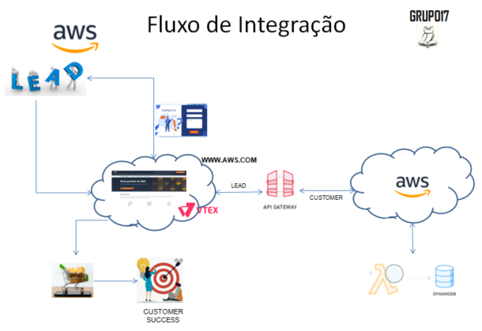
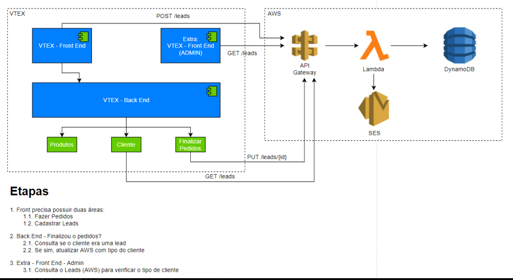

 

> # Hiring Coders - Grupo 17 - AWS 
Hiring Coders FASE#3- Desafio Final (Gama Academy, Vtex. AWS) 
 
 

> # Índice

  <ol>
    <li><a href="#desafio">Desafio</a></li>
    <li><a href="#objetivos">Objetivos</a></li>
    <li><a href="#equipe">Equipe do Projeto</a></li>
    <li><a href="#planjemento">Planejamento</a></li>
    <li><a href="#ferramentas">Ferramentas e Linguagens</a></li>
    <li><a href="#arquitetura">Arquitetura</a></li>
    <li><a href="#frontend">Front End</a></li>
    <li><a href="#backend">Back End</a></li>
    <li><a href="#referencias">Referências</a></li>
  </ol>

<!-- DESAFIO -->
> # Desafio:
 

O projeto terá a temática da API que deve estar relacionada com o mercado de cada patrocinador!! 
Os patrocinadores são: AWS + ACCT + Corebiz 
Vtex - <https://vtex.com> 
ACCT - <https://acct.global> 
AWS - <https://aws.amazon.com> 
Corebiz - <https://www.corebiz.ag> 
Gama Academy - <https://www.gama.academy> 
 
Nosso Grupo foi batizado com o número 17, ficamos com o tema do patrocinador Amazon Web Serviços. 
Criamos nosso logotipo e marca: 
 

 
 

Tema modelo foi da Amazon Web Services 
 
 

<!-- OBJETIVOS -->
>## Objetivos:
 

Desenvolver um projeto com o uso de API para servir a integração de Leads, Clientes e os pedidos vendidos no e-commerce da Amazon, utilizando as API´s VTEX.
API deverá gerenciar os clientes que se cadastrarem como lead, ou clientes que já compraram no e-commerce, permitindo o setor de Pós-venda promnover campanhas de marketing, envio de news letters, venda ativa, venda casada e realização de UPSELL. 
Ao concluir uma compra, verificar se o usuário que finalizou o carrinho de compra é o mesmo usuário cadastrado na base de dados lead da API AWS, identigicar e marcar este usuário que era somente um prospect na Base de Dados agora como cliente. 
Listar os produtos e serviçços oferecidos pela AWS. 
Listar cadastro de Leads e Clientes pelo Admin da Vtex. 
No modulo Admin Vtex, implementar Consultas, informando a evolução da conversão de Lead e Cliente. 
 
 
 

 
 

<!-- EQUIPE DO PROJETO -->
>## Equipe do Projeto (GRUPO17): 
 
Composta por dez participantes: 

| NOME                                 | ATRIBUIÇÃO                    |
|--------------------------------------|-------------------------------|
| Débora Goulart                       | Representante e Dev Front End |
| Alessandro de Albuquerque Apolinário | Dev Back End                  |
| Cássio Alves                         | Dev Back End                  |
| Daniel Campos Soares                 | Dev Front End                 |
| Gabriel Guilherme                    | Dev Back End                  |
| João Paulo Muner Lenat               | Dev Back End                  |
| Josana Klagenberg                    | Dev Front End                 |
| Karine Freitas Maciel Momose         | Dev Front End                 |
| Luiz Jorge Mir Filho                 | Dev Front End                 |
| Rubens Ciambarella                   | Dev Front End                 |

 
 

<!-- PLANEJAMENTO -->
># Planejamento:
 
Iniciamos com a análise do desafio, entendemos as premissas, riscos, vulnerabilidades e prinvcipalmente as oportunidades, listamos todos os tópicos importantes para atender os requisitos do projeto, bem como a solicitação do nosso Cliente.

Cada colaborador, enumerou as suas forças, aptidões, habilidades e experiência técnica, o que cada um tenha de melhor e forças (chamamos de Skill Soft e Skill Hard). 
Definimos utilizar as técnicas e a cultura Scrum Master para a gestão do Projetos, em combinação utilizamos o método Kanbam para controlar as tarefas. 

O Scrum é um framework para gerenciamento de projetos complexos, sendo um dos métodos ágeis mais populares do mundo. Muitas empresas estão abandonando modelos tradicionais e migrando para o modelo de trabalho proposto pelo Scrum, o que tem possibilitado entregas em menor tempo e com mais valor agregado para o cliente. 

Kanban é um sistema de controle e gestão do fluxo de produção em empresas e projetos que usa de cartões coloridos (post-its) e também recebe o nome de gestão visual, em razão do uso de cores como sinalizadores. 

O Grupo definiou como meta o primeiro MVP (minimum value product). A partie desye ponto, foi possível desenvolver um produto e apresentar ao nosso Cliente. 

Utilizamos a ferramenta Trello, para registrar todas as funcionalidades do MVP, transformando cada requisito a desenvolver, em tarefas enumeradas e listadas por colaborador. Cada Colabot=radorm recebeu sua meta e objetivos, cada um na medida que aoluia na codificação, realizada o controle e alterações naevolução do desenvolvimento do projeto. 

Diariamente, antes de cada mentoriam o grupo se reunia, debatia as dificuldades, explorava a Mentoria comnpartilhando as necessidades para destravar a tarefa. Os Mentores  ajudavam, sugerindo dicas e compartilhando experiências. COM as orientações dos Mentores, buscavamos aprimorar o desenvolvimento dos algorotimos, na medida que faziamos pesquisas e estudos, descobriamos mais técnicas e melhores práticas para solucionar as dificuldades do dia a dia.

Utilizamos as ferramentas Gather e Discord para realizar as reuniões, detalhar, debater as evoluções e dificuldades. 

**Discord** é um aplicativo de comunicação instantânea, em que você pode trocar mensagens de áudio, texto e vídeo.  

O **Gather** é um espaço virtual feito para o encontro entre pessoas. Pode ser amigos, familiares e, até mesmo, a sua equipe durante o horário de trabalho. ... O site é ótimo para equipes que precisam se comunicar muito no dia a dia. 

 
 

<!-- ARQUITETURA -->
>## Arquitetura utilizada:
 

 
 

<!-- FERRAMENTAS -->
>## Ferramentas e linguagens:

Utilizamos a plataforma de desenvolvimento **Vtex IO**, aplicamos o uso das linguagens de programação Java Sript, Python, mescamos o desenvolvimento de componentes de integração com react e Node.

Para estilizar e tornar a experência de usuário mais produtiva, ágil e dinâmica. Utilizou as melhores práticas com as **linguagens de tipação CSS, Tackyons e Markdown.**  

Utilizamos os serviços da **Amazon Web Services**, 

**API Gateway**: 
O Amazon API Gateway é um serviço da AWS para criação, publicação, manutenção, monitoramento e proteção de APIs REST e WebSocket em qualquer escala. Os desenvolvedores de API podem criar APIs que acessem a AWS ou outros web services, bem como dados armazenados na Nuvem AWS. 

 **AWS Lambda**:  
 O AWS Lambda é um serviço de computação sem servidor que permite executar código sem provisionar ou gerenciar servidores, criando lógica de dimensionamento de cluster com reconhecimento de workloads, mantendo integrações de eventos ou gerenciando tempos de execução. <bt>

 **DynamoDB**: 
 O Amazon DynamoDB é um banco de dados de valores-chave e documentos que oferece desempenho em milissegundos de um dígito em qualquer escala. É um banco de dados totalmente gerenciado, multirregional, multiativo e durável com segurança, backup e restauração integrados e armazenamento em cache na memória para aplicativos em escala de Internet.  
  
 **SES (Simple Email Service)**: 
O Amazon Simple Email Service (SES) é um serviço em nuvem de e-mail eficaz, flexível e dimensionável. Com ele, os desenvolvedores podem enviar e-mails de qualquer aplicação. É possível configurar rapidamente a compatibilidade do Amazon SES com vários casos de uso de e-mails, como comunicações transacionais, de marketing ou de e-mails em massa. 
 

<!-- FRONT END -->
># Implementação do Front End: 

Utilizamos **VTEX IO** que é uma plataforma low-code development que possibilita um gerenciamento com foco na experiência do usuário para seu e-commerce. Em outras palavras, fornece as ferramentas para você se concentrar no que realmente importa para os seus negócios, sem precisar lidar com problemas e desafios de infraestrutura. 

É simples. Acima de tudo, os workspaces da VTEX IO, como o nome indica, permitem criar várias versões do seu código, atualizando cada workspace com a plataforma. Por conta disso, possibilita:

► Realizar testes A/B 
► Evitar quebras e possíveis erros em sua loja 
► Aumentar a segurança na experiência de usuário  
► Além disso, é capaz de acompanhar a evolução da loja, ajudando com cada teste, progressivamente, o que evita problemas inesperados. 
► React: linguagem mais flexível 
► Desenvolvida pela equipe do Instagram em meados de 2011, o React é uma biblioteca em Javascript capaz de flexibilizar a criação de interfaces para o usuário. Por ser uma linguagem declarativa, é extremamente eficiente e traz apoio ao desenvolvimento. 
► Sendo uma biblioteca, e não um framework, a linguagem permite maior flexibilidade no desenvolvimento por parte do desenvolvedor. Ou seja, não ficando preso ou limitado por parte daquele framework. 

Utilizamos o bloco básico do Store Framework para criar a loja, foi o **tema Minimum-boilerplate-theme**: 

Para customizar a Loja, foram utilizados os handles de CSS, que auxiliam na customização dos componentes da sua loja através de classes de CSS no código do tema. Todas essas configurações são definidas através da app vtex.css-handles, responsável por declarar todos os pontos de customização do seu bloco. 

Definindo os nomes dos seus handles e adicionando aos seus respectivos elementos HTML, é possível entregar ao usuário do tema pontos de customização que permitam criar layouts flexíveis. 

Utilizamos o Tachyons, que é um framework para CSS funcional. Ele não apresenta componentes UI "pré-buildados". Na verdade, seu objetivo é justamente separar as regras de CSS em partes pequenas e reutilizáveis. 

**Utilizamos os blocos**: LIstamos alguns blocos utilizados no projeto 
        flex-layout.row#slider 
        responsive-layout.desktop#mission 
        responsive-layout.desktop#carousselserv 
        responsive-layout.desktop#patro 
        responsive-layout.mobile#patro1 
        flex-layout.row#main-title 
        flex-layout.row#characteristics 
        responsive-layout.desktop#regions 
        responsive-layout.mobile#regions 
        responsive-layout.desktop#mission1 
        stack-layout#s3 
        flex-layout.row#s3 
        flex-layout.row#s3Icons 
        search-result-layout.customQuery#s31 

 
 

<!-- BACK END -->
># Implementação do Back End: 
 
 

># Referências:
 

>## Treinamento Apps Vtex e Templates:
<https://drive.google.com/drive/folders/1ENlJP6QgeVd1dACZgLlad0OstpOLHTLD> 
 
 

>## PLataforma de desenvolvimento Vtex IO
<https://learn.vtex.com> 
<https://developers.vtex.com>
 
 

>## exemplo de arquivo API Gateway para estudo: 
<https://github.com/awslabs/aws-api-gateway-developer-portal/blob/master/cloudformation/template.yaml> 
<https://github.com/mattpodolak/email-api-lambda> 
<https://github.com/amazon-archives/realworld-serverless-application/blob/master/backend/sam/app/api.emplate.yaml> 
 
 

>## Temática AWS
<https://aws.amazon.com> 

